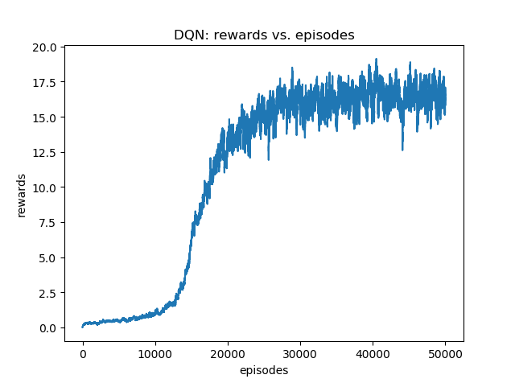

使用 Reinforcement Learning 玩 Atari Games

**Pong训练不起来，不知道为什么，感觉和参考的代码 rl_pong.py 一样啊。。。**

# 环境安装

安装 OpenAI Gym Atari 环境

- Linux 下安装
```
pip install opencv-python gym 
pip install gym[atari]
```

- windows 下安装
```
pip install opencv-python gym
pip install --no-index -f https://github.com/Kojoley/atari-py/releases atari_py
```

gym 文档参见 http://gym.openai.com/docs/

# How to run :
training policy gradient:
* `$ python main.py --train_pg`

testing policy gradient:
* `$ python test.py --test_pg`

training DQN:
* `$ python main.py --train_dqn`

testing DQN:
* `$ python test.py --test_dqn`

# 一些Tips

## Pong

- 对 observation 做clip
	
	从 210x160x3 uint8 frame 到 (80x80) 1D float vector

- discount reward

	在每次  reward != 0 的时候，将running_reward置为0，重新计算 discount reward

- action space reduction

	只使用 UP_ACTION = 2 和 DOWN_ACTION = 3

- feed difference frames

	Ideally you’d want to feed at least 2 frames to the policy network so that it can detect motion. To make things a bit simpler (I did these experiments on my Macbook) I’ll do a tiny bit of preprocessing, e.g. we’ll actually feed difference frames to the network (i.e. subtraction of current and last frame).

# 结果
## Pong: policy gradient

## BreakoutNoFrameskip: dqn

- Improvements to DQN:
	- [x] Double Q-Learning
 	- [x] Dueling Network
 	- [ ] Prioritized Replay Memory
 	- [ ] Noisy DQN
 	- [ ] Distributional DQN

- Training Hint
	- The action should act ε-greedily
 		- [x] Random action with probability ε
 		- [x] Also in testing
	- Linearly decline ε from 1.0 to some small value, say 0.025
 		- [x] Decline per step
 		- [x] Randomness is for exploration, agent is weak at start
- Hyperparameters
	- [x] Replay Memory Size 10000
	- [x] Perform Update Current Network Step 4
	- [x] Perform Update Target Network Step 1000
	- [x] Learning Rate 1e-4
	- [x] Batch Size 32

### Learning Curve

- DQN + Double Q-Learning + Dueling Network


### 测试结果
```
test episode: 0, reward: 293.0, i_steps: 1263
test episode: 1, reward: 19.0, i_steps: 174
test episode: 2, reward: 8.0, i_steps: 68
test episode: 3, reward: 72.0, i_steps: 358
test episode: 4, reward: 24.0, i_steps: 125
test episode: 5, reward: 14.0, i_steps: 523
... ...
test episode: 95, reward: 10.0, i_steps: 406
test episode: 96, reward: 4.0, i_steps: 167
test episode: 97, reward: 8.0, i_steps: 197
test episode: 98, reward: 96.0, i_steps: 640
test episode: 99, reward: 188.0, i_steps: 475
Run 100 episodes
Mean: 72.59
```


# 其他参考资料

- [Learning to Play Pong using Policy Gradient Learning](https://arxiv.org/abs/1807.08452)

- [Andrej Karpathy blog: Deep Reinforcement Learning: Pong from Pixels](http://karpathy.github.io/2016/05/31/rl/)

- [rl_pong.py](https://gist.github.com/greydanus/5036f784eec2036252e1990da21eda18)
